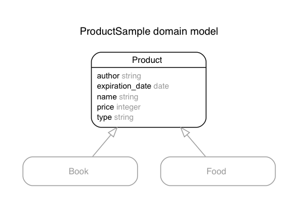

### 2.2 STI(単一テーブル継承)

#### 2.2.1 STIとは
ここでは、STIを解説していきます。まず、初めにSTIの特徴を簡単に列挙します。
- `Single Table Inheritance(単一テーブル継承)`の略称
- オブジェクトの継承関係を１つのテーブルで表現。(1つのテーブルで複数のモデルを扱うことができる)
- typeという名前のカラムが必要で、そこには各レコードが表すサブクラスの名前が保存される。

_ _ _

##### STIの詳細
もう少し掘り下げてSTIを説明していきます。STIとはオブジェクト指向設計で抽出されたスーパークラス・サブクラスから成る継承階層をリレーショナルデータベースのテーブルとして実装するためのパターンの一つです。
リレーショナルなデータベースでは継承をサポートをしていないので、オブジェクトの継承関係をデータベースに表現する必要があります。
その表現パターンとしては、次の3つがあります。

- `Single Table Inheritance(単一テーブル継承)`
- `Class Table Inheritance(クラステーブル継承)`
- `Concrete Class Inheritance(具象クラス継承)`

従ってSTIは、Rails固有の実装パターンではなく、実装パターンの手法のひとつ(ORマッピングのための汎用的な手法のひとつ)と言えます。  

ただ、Railsではこの中の`Single Table Inheritance(単一テーブル継承)`を標準でサポートしており、
テーブル定義とクラスの継承によって、STIを簡単に扱うことができるという事になります。

例えばECサイトで商品(Product)として、本(Book)と食品(Food)を扱っており、
同じカラムと異なるカラムがある場合に、次のように1つのテーブルで３つのオブジェクト(Product,Book,Food)を表現します。
こうすることで、Rails側でbooksテーブルとfoodsテーブルが1つのテーブルで表現できます。

次の例だと、Productテーブル1つでBook(本)とFood(食品)のモデルを表現しています。

Product : 商品テーブル

|field名|名称|型|
|:--|:--|:--|
|name|名前|string|
|price|価格|integer|
|author|著者|string|
|expiration_date|賞味期限|date|
|type|タイプ|string|

|id|name|price|author|expiration_date|type|
|:--|:--|:--|:--|:--|:--|
|1|坊ちゃん|300|夏目漱石|NULL|Book|
|2|さば缶|100|NULL|2018/01/01|Food|

- name,price:共通項目
- author:Bookのみの項目
- expiration_date:Foodのみの項目
- type:どのタイプ(型)か

実際には、「typeカラムを保持したテーブルであること」、「マッピングされたモデルの派生クラスがあること」が条件となっています。
「マッピングされたモデルの派生クラスがあること」とは、次の例だとProductモデルを継承したBookモデルと、Foodモデルが必要となります。

- テーブルにはサブクラスを判断するためのカラム（type）が必要
- テーブルに対応するモデルクラスを継承したクラスが必要

簡単にSTI以外の2つパターンの特徴も述べておきます。
今回はSTIの解説となり、深くは説明しませんので、気になる人は、詳細を調べてみましょう。

  - `Class Table Inheritance(クラステーブル継承)`  
  オブジェクトの継承関係をクラスごとに１テーブルを用意することで表現します。
  スーパークラスのテーブルにはスーパークラスの持つカラムを、サブクラスのテーブルにはサブクラスの持つカラムのみを持たせます。

  - `Concrete Class Inheritance(具象クラス継承)`  
  オブジェクトの継承関係を具象クラスだけ対応したテーブルを用意することで表現します。
  各テーブルにはスーパークラスが持つカラムを共通属性として持たせます。

  _ _ _

##### STIのメリット、デメリット
ここではSTIのメリット、デメリットを記述します。
STIを使用する際にそもそもサブクラス化する必要があるのか、別々のテーブル、モデルにするべきかもしれないことを検討することも大切となります。

- メリット
  - 必要なテーブルが1つだけになる。サブクラスが増加してもテーブル数は増加しない。
  - 親で設定したリレーションやvalidates等は全て子クラスにも引き継がれる。(DRYに実装できる)
- デメリット
  - 特定のサブクラスの固有の属性に対してNOT NULL制約を適用できない
  - テーブルのカラム数が多くなりやすい
  - 一部のサブクラスでしか使用しない列の値がNULLとなる。

_ _ _

#### 2.2.2 STIの実装例
それでは、実際に新規プロジェクトを作成して、2.2.1のProductテーブルを例にSTIを実装していきましょう。
継承関係は次の図の通りとなり、Productクラスを継承したBookクラスとFoodクラスがあるとします。
もう一度STIの実装方法をおさらいしましょう。次の2つが必要でしたね。この2つを意識しながら実装していきましょう。

- テーブルにはサブクラスを判断するためのカラム（type）が必要
- テーブルに対応するモデルクラスを継承したクラスが必要



##### Railsプロジェクトの作成
新規プロジェクトを作成しましょう。

```
$ rails new sti_sample
$ cd sti_sample
```
##### GeneratorでProduct,Book,Foodを作成
まずはscaffoldで、Productを作成します。

```
$ rails generate scaffold Product name:string price:integer
author:string expiration_date:date type:string
```

次にProductモデルを親にして、BookモデルとFoodを作成します。
generateオプションの`--parent`で継承する親のモデルを指定します。

```
$ rails generate model Book --parent Product
$ rails generate model Food --parent Product
```

マイグレートを実行します。

```
$ rails db:migrate
```

バリデーションも追加しておきましょう。

`app/models/product.rb`
``` ruby
class Product < ApplicationRecord
  validates :name,  presence: true
  validates :price, presence: true
  validates :type,  presence: true
end
```

`app/models/book.rb`
``` ruby
class Book < Product
  validates :author,  presence: true
end
```

`app/models/food.rb`
``` ruby
class Food < Product
  validates :expiration_date,  presence: true
end
```

これでRailsでSTIが自動で行われるようになります。
コンソールで動作を確認してみましょう。

```
$ rails console

# typeを"Book"にすると、自動的にBookモデルが作成される
Product.new type: "Book"
# => #<Book id: nil, name: nil, price: nil, author: nil, expiration_date: nil,
type: "Book", created_at: nil, updated_at: nil> nil, author_id: nil,
created_at: nil, updated_at: nil>

# typeを"Food"にすると、自動的にFoodモデルが作成される
Product.new type: "Food"
# => #<Food id: nil, name: nil, price: nil, author: nil, expiration_date: nil,
type: "Food", created_at: nil, updated_at: nil>il,
created_at: nil, updated_at: nil>

# typeを""(ブランク)にすると、Productモデルが作成される(nil, false, [], {} なども
Productモデルが作成される)
Product.new type: ""
# => #<Product id: nil, name: nil, price: nil, author: nil,
expiration_date: nil, type: "", created_at: nil, updated_at: nil>

# typeにサブクラス名かブランク以外の値を設定するとActiveRecord::SubclassNotFound例外が
発生する
Product.new type: "hoge"
# => ActiveRecord::SubclassNotFound: The single-table inheritance mechanism
failed to locate the subclass: 'hoge'. This error is raised because the column
'type' is reserved for storing the class in case of inheritance. Please rename
this column if you didn't intend it to be used for storing the inheritance
class or overwrite Product.inheritance_column to use another column
for that information.
```

##### STIに合わせてルーティングを修正
今回は説明をシンプルにするために、コントローラー、ビューはProductのものを使用することにします。
もちろん、ProductsControllerを継承して、BooksController、FoodsControllerとして実装することもできます。
今の状態だと、Bookオブジェクト、Foodオブジェクトの場合には、books_path、foods_pathに遷移しようとするのでbooksとfoodsのルーティングを次の通りに追加しましょう。

`config/routes.rb`
``` ruby
Rails.application.routes.draw do
  resources :products
  # 追加箇所
  # 今回はbooksやfoodsのパスでもProductsControllerを使うように設定する
  resources :books,controller: :products
  resources :foods,controller: :products
end
```

追加できたらルーティングを確認してみましょう。

```
$ rails routes

Prefix          Verb   URI Pattern                  Controller#Action
products        GET    /products(.:format)          products#index
                POST   /products(.:format)          products#create
new_product     GET    /products/new(.:format)      products#new
edit_product    GET    /products/:id/edit(.:format) products#edit
product         GET    /products/:id(.:format)      products#show
                PATCH  /products/:id(.:format)      products#update
                PUT    /products/:id(.:format)      products#update
                DELETE /products/:id(.:format)      products#destroy
books 　　　　　　GET    /books(.:format)             products#index
                POST   /books(.:format)             products#create
new_book        GET    /books/new(.:format)         products#new
edit_book 　　　 GET    /books/:id/edit(.:format)    products#edit
book            GET    /books/:id(.:format)         products#show
                PATCH  /books/:id(.:format)         products#update
                PUT    /books/:id(.:format)         products#update
                DELETE /books/:id(.:format)         products#destroy
foods           GET    /foods(.:format)             products#index
                POST   /foods(.:format)             products#create
new_food        GET    /foods/new(.:format)         products#new
edit_food       GET    /foods/:id/edit(.:format)    products#edit
food            GET    /foods/:id(.:format)         products#show
                PATCH  /foods/:id(.:format)         products#update
                PUT    /foods/:id(.:format)         products#update
                DELETE /foods/:id(.:format)         products#destroy
```

##### STIに合わせてビューを修正
まずは、`form_with(model: product, local: true)`の箇所を`form_for(@product, as: :product)`に変更しましょう。
@productの中身がBookオブジェクトやFoodオブジェクトになる場合に、name属性の値がbook[name]やfood[name]となり、コントローラーのStrongParametersの箇所でエラーになってしまいます。
そのため、@productの中身に関係なくname属性をproduct[name]とするようにするためにこの修正が必要です。

次に、今回Bookモデルでは、expiration_date（賞味期限）は使用しないカラムとなるため、ビューでexpiration_dateの初期設定をブランクにしましょう。

`app/views/products/_form.html.erb`
``` html
<!-- 修正箇所  -->
<%= form_for(product,  as: :product) do |form| %>
  <% if product.errors.any? %>
    <div id="error_explanation">
      <h2><%= pluralize(product.errors.count, "error") %> prohibited this
      product from being saved:</h2>
      <ul>
      <% product.errors.full_messages.each do |message| %>
        <li><%= message %></li>
      <% end %>
      </ul>
    </div>
  <% end %>

(中略)

<div class="field">
  <%= form.label :expiration_date %>
  <!-- 修正箇所  include_blank: true　を追加-->
  <%= form.date_select :expiration_date, id: :product_expiration_date,
  include_blank: true %>
</div>

(中略)

```

_ _ _

##### 動作確認
最後に、商品を登録等して動作を確認してみましょう。
