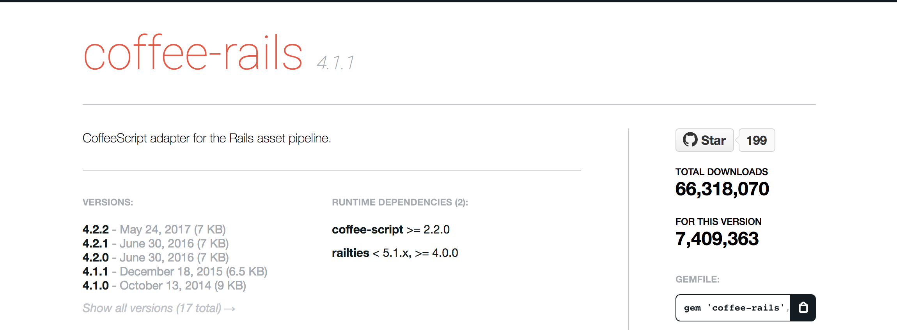
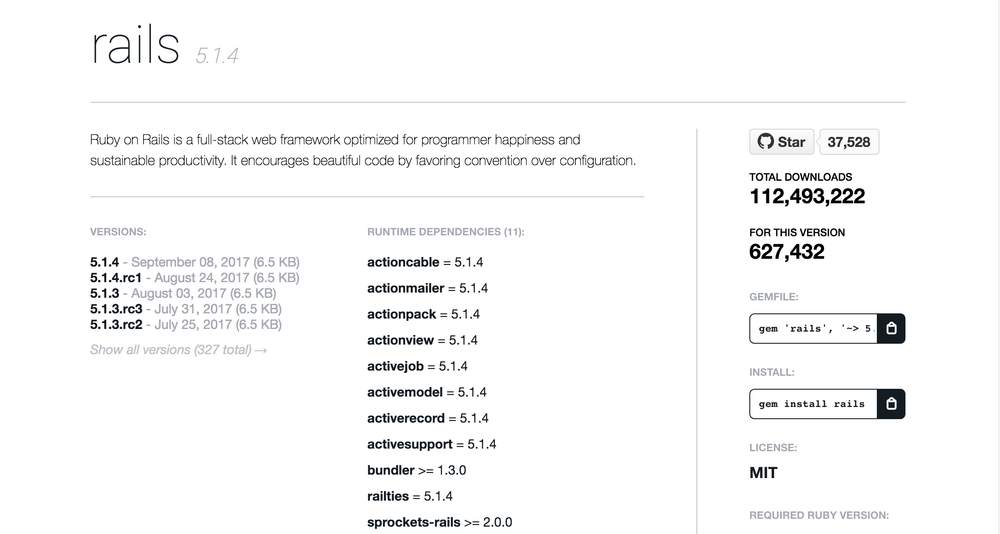

## 2.6 Railsバージョンアップ

Railsは新しいことにチャレンジするプロジェクトですので、バージョンアップの頻度も多いです。Rails公式のバージョンアップマニュアルもありますが、アプリケーションによってそれぞれ対応すべきことがあります。このカリキュラムではREx[^1]を題材にバージョンアップを行います。

1. Rails 5.1.4にGemfileを更新
1. 設定ファイルの更新
1. テスト実行

### 2.6.1 Rails 5.1.4にGemfileを更新

GemfileにあるRailsのバージョンアップを行います。現在のところRails 5.1.4が最新バージョンなのでGemfileを更新します。

```diff
diff --git a/Gemfile b/Gemfile
index 7f53ce2..6c094b5 100644
--- a/Gemfile
+++ b/Gemfile
@@ -2,7 +2,7 @@ source 'https://rubygems.org'


 # Bundle edge Rails instead: gem 'rails', github: 'rails/rails'
-gem 'rails', '4.2.8'
+gem 'rails', '5.1.4'
 # Use sqlite3 as the database for Active Record
 gem 'sqlite3'
 # Use SCSS for stylesheets
```

更新が終わったら`bundle update rails`を実行します。アプリケーションにもよりますがRExでは依存するgemのバージョンが合わないエラーが起きました。ここからは地道な作業になります。エラーになったgemのバージョンを1つずつ適切なバージョンに上げていきます。適切なバージョンを調べるにはRubyGemsを使います。`coffee-rails`を例に作業を進めてみます。

```
Bundler could not find compatible versions for gem "railties":
  In Gemfile:
    coffee-rails (~> 4.1.0) was resolved to 4.1.1, which depends on
      railties (< 5.1.x, >= 4.0.0)
  （略）
```

`coffee-rails`のインストールで起きたエラーをじっくり読み進めてみましょう。`coffee-rails`はGemfileには`~> 4.1.0`とバージョン指定してインストールしています。`~>`は特殊なバージョン指定の仕方です。`~> 4.1.0`とすると`>= 4.1.0`かつ`< 4.2.0`という意味になります。`bundle update`を実行すると特定の範囲のなかでバージョンアップを行おうとします。この範囲だと`4.1.1`が最新ということになります。



`4.1.1`をインストールしようとすると依存するgemに`railties`があります。バージョンは`< 5.1.x`かつ`>= 4.0.0`になっている一方で、Rails 5.1.4ではrailtiesは`5.1.4`を期待しています。そのため、アップデート時にエラーになっています。



Rails 5.1.4にアップデートするのが主な目的なので`coffee-rails`のバージョンをrailtiesのバージョンに合うように修正します。今回は`coffee-rails`のバージョンを`4.2.2`に合わせるようにしました。

```
# Use Uglifier as compressor for JavaScript assets
gem 'uglifier', '>= 1.3.0'
# Use CoffeeScript for .coffee assets and views
-gem 'coffee-rails', '~> 4.1.0'
+gem 'coffee-rails', '~> 4.2.2'
# See https://github.com/rails/execjs#readme for more supported runtimes
gem 'therubyracer', platforms: :ruby
```

`coffee-rails`で手順を解説しましたが、他のgemに対しても同様の手順でバージョンアップしていきます。

`bundle update rails`を何度も実行して、`Bundle updated!`が表示されるまで根気よくやりましょう。

### 2.6.2 設定ファイルの更新

Railsは設定ファイルは`rake app:update`を実行してバージョンアップを行います。既存ファイルの内容や新規ファイルを作成してくれます。対話的に進めることが出来るので、内容の確認を行いながら進めていきます。長く運用されてきたプロジェクトでは設定ファイルひとつで動かなくなるケースもありますので、注意して進める必要があります。どのような修正をすべきなのかはアプリケーション毎にかなり異なりますのでここでは解説はしません。

```
$ bin/rake app:update
Running via Spring preloader in process 53099
Overwrite /Users/awesome-user/ruby/guppy0356/ruby-license/config/boot.rb?
(enter "h" for help) [Ynaqdh]
Overwrite /Users/awesome-user/ruby/guppy0356/ruby-license/config/routes.rb?
(enter "h" for help) [Ynaqdh]
Overwrite /Users/awesome-user/ruby/guppy0356/ruby-license/config/application.rb?
(enter "h" for help) [Ynaqdh]
Overwrite /Users/awesome-user/ruby/guppy0356/ruby-license/config/environment.rb?
(enter "h" for help) [Ynaqdh]
Overwrite /Users/awesome-user/ruby/guppy0356/ruby-license/config/secrets.yml?
(enter "h" for help) [Ynaqdh]
Overwrite /Users/awesome-user/ruby/guppy0356/ruby-license/config/environments/
development.rb? (enter "h" for help) [Ynaqdh]
Overwrite /Users/awesome-user/ruby/guppy0356/ruby-license/config/environments/
production.rb? (enter "h" for help) [Ynaqdh]
Overwrite /Users/awesome-user/ruby/guppy0356/ruby-license/config/environments/
test.rb? (enter "h" for help) [Ynaqdh]
Overwrite /Users/awesome-user/ruby/guppy0356/ruby-license/config/initializers/
assets.rb? (enter "h" for help) [Ynaqdh]

After this, check Rails upgrade guide at http://guides.rubyonrails.org/upgrading_ruby_on_rails.html for more details about upgrading your app.
```

もし、`rake app:update`で次のようなエラーが起きたら`config/application.rb`の内容を一部削除する必要があります。

```
/Users/awesome-user/.rvm/gems/ruby-2.4.1/gems/activerecord-5.1.4/lib/
active_record/dynamic_matchers.rb:22:in `method_missing': undefined method
`raise_in_transactional_callbacks=' for ActiveRecord::Base:Class (NoMethodError)
```

- config/application.rb
```
config.active_record.raise_in_transactional_callbacks = true # 削除
```

### 2.6.3 テスト実行

設定ファイルを修正できたら、アプリケーションが適切に動作しているかチェックする必要があります。RExではエンドツーエンドテストを自動化していますので簡単に設定に不備がないか等のバージョンアップに伴う障害を見つけることが出来ます。テストが無い場合はバージョンアップは危険ですので、控えたほうが良いと思います。

```
$ bin/rspec spec/acceptance/exam_history.feature

Randomized with seed 23893

Take Examination
  Take Ruby Programmer Silver
    Given build 100 ruby programmer silver examinations ->
    When I sign up for REx -> And I take silver examination ->
    And I get 76 score -> Then screen displays "今回の点数は、76点だよ！"


    （略）


Finished in 50.8 seconds (files took 9.39 seconds to load)
63 example, 0 failures

Randomized with seed 23893
```

失敗したテストはありませんでした。これで安心してバージョンアップしたアプリケーションをリリースすることが出来ます。

----
[^1]: REx https://rex.libertyfish.co.jp/
